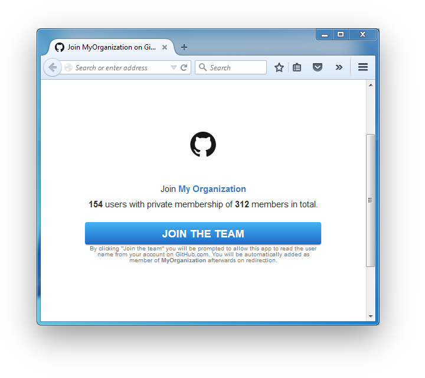
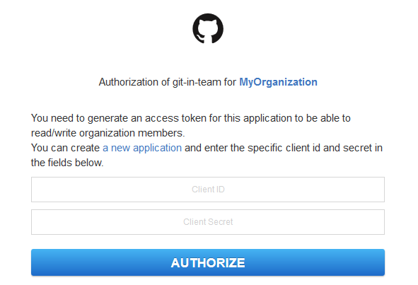
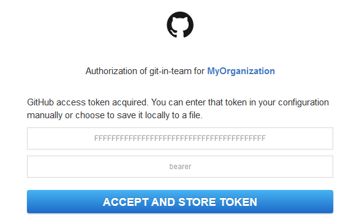

# Git-in-Team

A little server that enables self-invitation to a Github organization.

It provides

- A landing page you can point users to join your organization/team by
  authorizing their GitHub account and receive an invite (`http://githubteam.yourdomain.com`)
- An `<iframe>` badge to embed on any website that shows connected users.
- A SVG badge that works well from static mediums (like GitHub README pages)

## How to use

### Heroku

Use the button below to deploy to Heroku

[](https://heroku.com/deploy?template=https://github.com/RattleSN4K3/git-in-team/tree/master)

Or manually setup your Heroko app:
0. Create a new Heroku app  
`heroku apps:create APP_NAME`
0. Provide GITHUB_ORGANIZATION  
`heroku config:set GITHUB_ORGANIZATION=XXXX`
0. Optionally provide GITHUB_API_TOKEN and GITHUB_API_TYPE  
`heroku config:set GITHUB_API_TOKEN=XXXX GITHUB_API_TYPE=YYYY`
0. Optionally provide GITHUB_APP_ID and GITHUB_APP_SECRET  
`heroku config:set GITHUB_APP_ID=XXXX OAUTH_CLIENT_SECRET=YYYY`
0. Push changes to heroku  
`git push heroku master`  
or  
`heroku restart`


### Server

Or install it and launch it on your server:

```bash
$ npm install -g gitinteam
$ gitinteam "your-github-organization"
```

The available options are:

```
Usage: gitinteam [options] <github-organization> [<api-token> <api-token-type> <app-id> <app-secret>]

Options:

  -h, --help               output usage information
  -V, --version            output the version number
  -p, --port <port>        Port to listen on [$PORT or 3000]
  -i, --interval <int>     How frequently (ms) to poll Slack [$GITHUB_INTERVAL or 30000]
  -s, --silent             Do not print out warns or errors
```

### Dynamic Badge


```html
<script async defer src="http://githubteam.yourdomain.com/gitinteam.js"></script>
```

or for the large version, append `?large`:

```html
<script async defer src="http://githubteam.yourdomain.com/gitinteam.js?large"></script>
```

### SVG


```html

```

or change the text by appending the `t` query parameter with the value of your text. Also by appending `s`, you can switch to a different color mode:

```html

```


### Landing page



Point to `http://githubteam.yourdomain.com`.

**Note:** A image for the logo of the landing page
is retrieved from the GitHub API. If your organization
doesn't have one configured, it won't be shown like in the picture above.

## Setup

Visit your app page once and in order to setup your GitHub application, API token and app tokens.





**Note:** This step is very important if the important credentials are not entered before. This would allow other users to take over your app.

## API

Requiring `gitinteam` as a module will return
a `Function` that creates a `HTTP.Server` instance
that you can manipulate.

```js
require('gitinteam')({
  org: 'your-github-organization', // required
  token: 'yourtoken',
  token_type: 'Bearer',
  client_id: 'app_client_id',
  client_secret: 'app_client_secret',
  silent: false, // suppresses warnings and additional log entries
  interval: 30000
}).listen(3000);
```


## Credits

- Guillermo Rauch (rauchg) for the [slackin](https://github.com/rauchg/slackin) software
- The SVG badge generation was taken from the
excellent [shields](https://github.com/badges/shields) project.
- The button CSS is based on
[github-buttons](https://github.com/mdo/github-buttons).

## License

MIT
